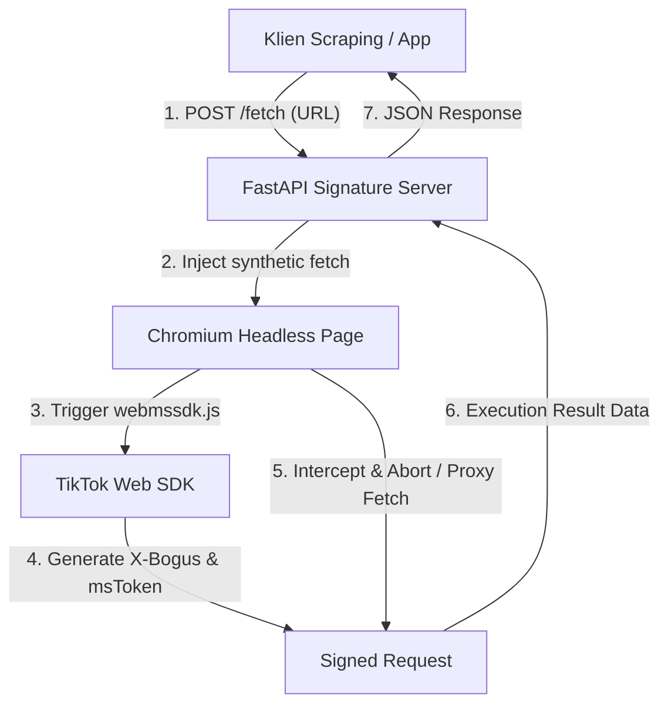

# 🔑 TikTok Signature API — Python Port


Server penandatangan (*signature engine*) API TikTok berbasis Python (Porting dari [`carcabot/tiktok-signature`](https://github.com/carcabot/tiktok-signature) Node.js). 

Server ini secara otomatis mengeksekusi SDK `webmssdk.js` resmi TikTok di dalam Chromium Headless untuk meng-generate token `X-Bogus`, `X-Gnarly`, `X-Dynosaur`, `msToken`, dan mengelola cookies sesi guest.

---

## 📌 Daftar Isi
- [Cara Kerja](#-cara-kerja)
- [Arsitektur Alur Signature](#-arsitektur-alur-signature)
- [Cara Menjalankan Server](#-cara-menjalankan-server)
- [Dokumentasi API Endpoint](#-dokumentasi-api-endpoint)
  - [`GET /health`](#1-get-health)
  - [`POST /signature`](#2-post-signature)
  - [`POST /fetch`](#3-post-fetch)
  - [`POST /restart`](#4-post-restart)
- [Struktur Project](#-struktur-project)
- [Tabel Konfigurasi](#-tabel-konfigurasi)
- [Batasan & Troubleshooting](#-batasan--troubleshooting)

---

## 💡 Cara Kerja

Pendekatan lama seperti "menginjeksi file `webmssdk.js` versi lokal/vendor" sudah tidak kompatibel dengan bundle TikTok versi terbaru (menyebabkan penandatanganan gagal dan `X-Bogus=1`). 

Porting ini menggunakan mekanisme modern yang teruji:

1. **Inisialisasi Halaman Nyata**: Browser Chromium headless memuat halaman asli `tiktok.com` (`INIT_URL`), yang secara otomatis memuat SDK resmi dari CDN TikTok serta cookies sesi awal.
2. **Penandatanganan Sintetis**: Melalui `page.evaluate(fetch(url))`, hook SDK resmi di dalam halaman menandatangani request fetch sintetis.
3. **Intersepsi Request**: Request yang telah ditandatangani ditangkap via `page.expect_request` lalu segera di-**abort** (dibatalkan) sebelum keluar ke internet, sehingga tidak ada trafik ganda. Param bertanda tangan (`X-Bogus`, `msToken`, dll.) diekstrak dari URL.
4. **Pewarisan Parameter Lingkungan**: Parameter konteks (seperti `device_id`, `odinId`, `region`, dll.) diwarisi langsung dari request API asli TikTok untuk mencegah kegagalan `missing required fields`.
5. **Mode Proxy (`POST /fetch`)**: Request dikirim langsung dari dalam konteks halaman browser tempat SDK aktif, sehingga klien tidak perlu mengelola User-Agent maupun cookies secara manual.

---

## 🏗️ Arsitektur Alur Signature



---

## 🚀 Cara Menjalankan Server

### 1. Install Dependency & Browser
```bash
pip install -r requirements.txt
python -m playwright install chromium
```

### 2. Jalankan Uvicorn Server
```bash
python -m uvicorn main:app --port 8080
```
> Server akan berjalan secara default di `http://localhost:8080`.

### 3. Cek Status Kesehatan Server
Saat log terminal menunjukkan `[Server] Browser siap`, verifikasi status dengan:
```bash
curl http://localhost:8080/health
# Output saat siap: {"status":"ok","ready":true,"signCount":0,...}
# HTTP 503 dikembalikan selama browser belum siap.
```

---

## 📡 Dokumentasi API Endpoint

### 1. `GET /health`
Mengecek apakah instance browser Playwright siap menerima request penandatanganan.

* **Response (`200 OK` saat siap, `503` saat belum siap)**:
  ```json
  {
    "status": "ok",
    "ready": true,
    "signCount": 12,
    "sessionAgeMinutes": 2,
    "maxGenerationsBeforeRefresh": 500,
    "maxSessionAgeMinutes": 30.0
  }
  ```

---

### 2. `POST /signature`
Menandatangani URL API TikTok tanpa mengeksekusi HTTP request-nya. Mengembalikan URL lengkap bertanda tangan beserta User-Agent dan Cookie header.

* **Request Payload**:
  ```json
  {
    "url": "https://www.tiktok.com/api/search/general/full/?aid=1988&keyword=kuliner&count=12"
  }
  ```
* **Response (`200 OK`)**:
  ```json
  {
    "status": "ok",
    "data": {
      "signedUrl": "https://www.tiktok.com/api/search/general/full/?aid=1988&keyword=kuliner&count=12&X-Bogus=DFSzswVY...",
      "userAgent": "Mozilla/5.0 (Macintosh; Intel Mac OS X 10_15_7)...",
      "cookies": "ttwid=1%7C...;"
    }
  }
  ```

---

### 3. `POST /fetch` (Rekomendasi)
Menandatangani URL sekaligus mengeksekusi fetch secara langsung dari dalam browser headless, lalu mengembalikan data JSON mentah dari TikTok.

* **Request Payload**:
  ```json
  {
    "url": "https://www.tiktok.com/api/search/general/full/?aid=1988&keyword=kuliner&count=12&search_source=query&type=1&channel=tiktok_web"
  }
  ```
* **Contoh cURL**:
  ```bash
  curl -X POST http://localhost:8080/fetch \
    -H 'Content-Type: application/json' \
    -d '{"url": "https://www.tiktok.com/api/search/general/full/?aid=1988&keyword=kuliner&count=12&search_source=query&type=1&channel=tiktok_web"}'
  ```

---

### 4. `POST /restart`
Merefresh / mendaur ulang instance browser Playwright secara manual jika sesi usang atau SDK bermasalah.

* **Response (`200 OK`)**:
  ```json
  {
    "status": "ok",
    "message": "Browser restarted"
  }
  ```

---

## 🔐 Keamanan dan konfigurasi akses

Target `/signature` dan `/fetch` dibatasi ke URL HTTPS API TikTok. Server berjalan guest-only; mekanisme memasukkan cookie login berada di luar scope proyek.

Secara default API hanya dapat dipakai secara lokal dan CORS dinonaktifkan. Jika perlu mengekspos API melalui jaringan, gunakan token bearer:

```bash
SIGNATURE_API_TOKEN="ganti-dengan-token-kuat" \
SIGNATURE_CORS_ORIGINS="https://app.example.com" \
python -m uvicorn main:app --port 8080
```

Kirim token sebagai header `Authorization: Bearer <token>` pada `/signature`, `/fetch`, dan `/restart`. Jangan mengaktifkan akses publik tanpa autentikasi dan rate limit di reverse proxy.

---

## 📂 Struktur Project

```text
tiktok-signature-python/
├── main.py            # Entrypoint FastAPI server (Playwright async engine)
├── requirements.txt   # Dependency Python (fastapi, uvicorn, playwright)
├── README.md          # Dokumentasi teknis proyek
└── .gitignore         # Rules git ignore
```

---

## ⚙️ Tabel Konfigurasi

Variabel konfigurasi utama pada [`main.py`](main.py):

| Parameter | Nilai Default | Keterangan |
| :--- | :--- | :--- |
| `DEFAULT_UA` | Safari macOS (Intel) | User-Agent yang dikunci untuk pembuatan signature |
| `INIT_URL` | `tiktok.com/@zara` | Halaman nyata untuk menginisialisasi hook SDK & cookies guest |
| `MAX_SIGS_BEFORE_REFRESH` | `500` | Batas maksimum penandatanganan sebelum browser di-recycle |
| `MAX_SESSION_AGE_S` | `1800` (30 menit) | Umur maksimum sesi browser sebelum di-recycle otomatis |
| `SIGN_TIMEOUT_MS` | `8000` (8 detik) | Timeout maksimal menunggu penandatanganan URL |
| `SIGNATURE_API_TOKEN` | kosong | Token bearer opsional untuk endpoint mutasi |
| `SIGNATURE_CORS_ORIGINS` | kosong | Daftar origin CORS, dipisahkan koma |

---

## ❓ Batasan & Troubleshooting

> [!NOTE]
> **Pembatasan Mode Guest (Guest-Gate)**  
> Endpoint TikTok tertentu memang membatasi data pada sesi Guest. Proyek ini tidak mengelola cookie login.

> [!TIP]
> **Scope proyek**
> Proyek ini hanya menyediakan signature server dan proxy fetch; pengambilan serta pengolahan data menjadi tanggung jawab klien.

> [!IMPORTANT]
> **Error SSL Certificate di macOS**  
> Jika mengalami `certificate verify failed` saat melakukan fetch eksternal di macOS, jalankan:
> ```bash
> pip install certifi
> ```
